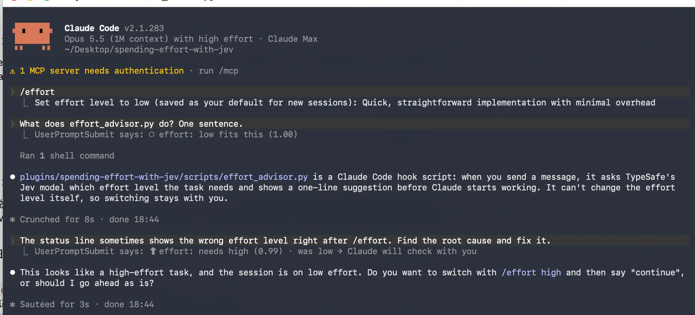
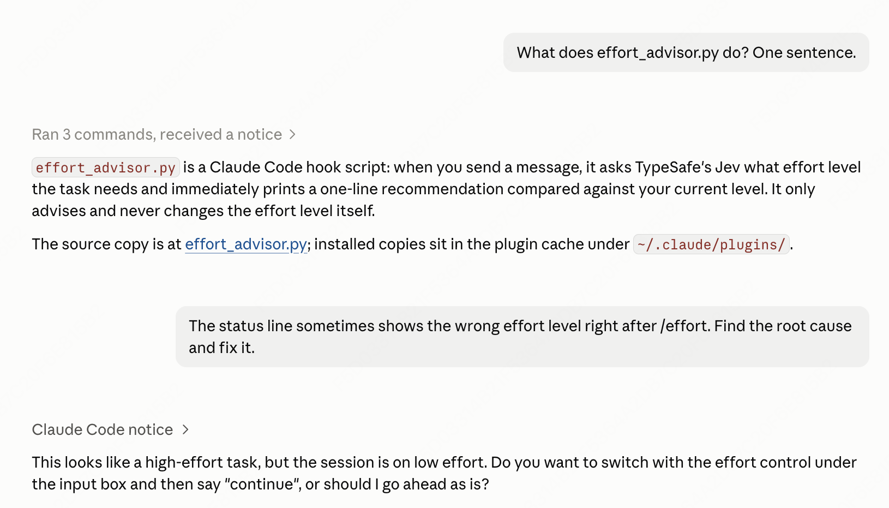
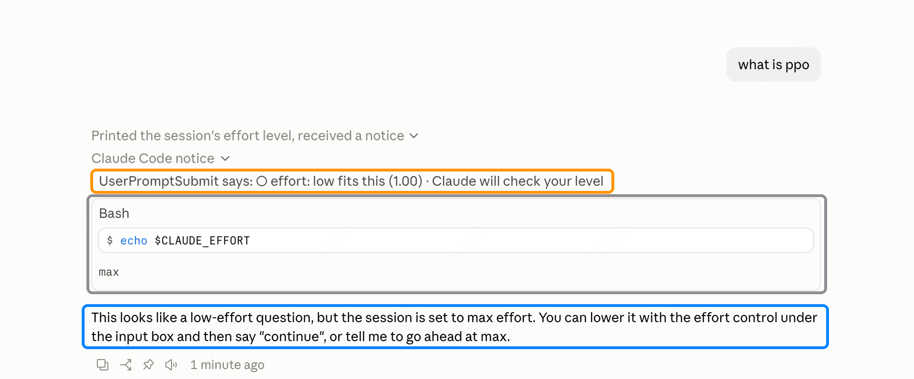

# spending-effort-with-jev

**Know which `/effort` level each message needs, the moment you send it.** A Claude Code plugin: every message you send is read by [TypeSafe](https://typesafe.ai)'s Jev model, which judges how much effort the task deserves. You get a one-line verdict before Claude starts working, so you can switch in time.

**Terminal:** on `low`, a quick question gets `○ low fits this`; a bug hunt gets `⬆ needs high`, and with `ask_first` on, Claude asks before starting. Orange: the plugin's line. Blue: Claude checking with you.

<p align="center"></p>

**Desktop app:** same flow. The line sits in the "Claude Code notice" (orange, click to expand); Claude's question (blue) points you to the effort control under the input box.

<p align="center"></p>

**Downgrade, on a session's first message:** on `max`, "what is ppo" gets `low fits this`. The plugin hasn't seen your level yet, so Claude reads it (gray), finds `max`, and offers to drop to `low` before answering (blue).

<p align="center"></p>

It suggests; it never switches effort for you.

## Install

**Easiest: let Claude Code install it.** Paste this into Claude Code:

```
Install the Claude Code plugin from https://github.com/Yaxin9Luo/spending-effort-with-jev.
Read its README first. Then:
1. Run: claude plugin marketplace add Yaxin9Luo/spending-effort-with-jev
2. Run: claude plugin install spending-effort-with-jev@spending-effort-with-jev
3. The plugin needs a TypeSafe API key (https://typesafe.ai); nothing else to install.
   Tell me to enter the key under /plugin (it goes to secure storage, not this chat).
4. Ask me whether to turn on ask_first (Claude asks before starting when the effort
   level looks wrong). If yes, run:
   claude plugin install spending-effort-with-jev@spending-effort-with-jev --config ask_first=true
5. Tell me to run /reload-plugins, then send a test message.
```

**Or by hand** (Python 3 and a [TypeSafe](https://typesafe.ai) API key needed):

```
/plugin marketplace add Yaxin9Luo/spending-effort-with-jev
/plugin install spending-effort-with-jev@spending-effort-with-jev
```

Paste your key when Claude Code asks; it's kept in secure storage and the plugin reads nothing else from your machine. Then `/reload-plugins`. Jev itself is a hosted API, so there's nothing else to install.

## What the lines mean

| Line | Meaning |
|---|---|
| `⬆ effort: needs high (0.99) · was low → Esc, /effort high, continue` | Needs more effort than you have. The first time, it tells you how to switch (in the desktop app: "stop, set high in the bar, continue"); if you stay put, later repeats are shorter. |
| `⬇ effort: low is enough (0.95) · was max → /effort low` | You're spending more than this needs. |
| `✓ effort: medium fits this (0.91) · last turn ran on medium` | The level your last turn ran on suits this message. If you've switched since, compare with that. |
| `○ effort: high fits this (0.98)` | The recommendation, when there's nothing trustworthy to compare with yet (a session's first message, or right after you pressed Esc to switch). With `ask_first`, the first message adds "· Claude will check your level". |
| `○ effort: maybe high (0.55), not sure · keep your level` | Jev's vote is split between staying and switching, so no advice. |
| `○ effort: nothing to judge here · keep your level` | "ok", "continue" and the like. Answered instantly, without calling Jev. |
| `⚠ effort: long run, fuzzy spec → have Claude interview you, then go max` | A long hands-off task with open questions. More effort won't fix a wrong reading of the task; a few questions first will. |

The number is how much of Jev's probability backs the line: for a switch, the share on levels in that direction; for "fits", the share within one level of yours. **"was low"** is the level your last completed turn ran on: hooks can't see a `/effort` switch until the next turn ends. (The optional status line below fixes that in the terminal.)

## Acting on a tip

- **To apply it to the current message:** stop Claude, switch, then send `continue`. Claude still has your request and picks it up at the new level. In the terminal that's Esc and `/effort high`; in the desktop app it's the stop button and the effort control in the bar under the input box. The line is worded for the client you're in. This works the same in both: once a message is sent, Claude starts at the current level, and a switch applies from the next message.
- **Or let Claude wait for you:** turn on `ask_first`. When a message looks like it needs a different level, higher or lower, Claude asks whether to switch before it does any work, and waits for your answer. On `max` for a quick question, it offers to drop to `low`; on `low` for a tricky bug, it offers `high`. It asks once per situation; if you choose to stay, it won't keep asking. On a session's first message, when the plugin hasn't seen your level yet, Claude reads it first (one quick `echo $CLAUDE_EFFORT`) and asks only if it's off. This is the easiest way in the desktop app.
- In the terminal, `/effort <level>` also saves that level as your default for the model; to change just this session, open `/effort` and press `s`. In the desktop app, use the effort control under the input box. (Typing `/effort <level>` there also works but changes this session only, and the label under the input box may keep showing the old level.)

## Options

Set them when you enable the plugin, or later under `/plugin`.

| Option | Default | What it does |
|---|---|---|
| `language` | `en` | `zh` for Chinese lines. |
| `quiet` | off | Only show a line when a switch is suggested (or a hand-off needs a spec). |
| `ask_first` | off | When a message needs a different level (up or down), Claude asks before it starts. |

## Optional: status line (terminal)

The status line is the one place Claude Code reports your *live* effort level, including right after `/effort`. With it, the bottom of the terminal shows e.g. `effort low · Jev: high ⬆`, then `effort high ✓` once you switch, and the notices compare against your real current level instead of the last turn.

After installing, start one session (the plugin copies the script to a stable path), then add to `~/.claude/settings.json`:

```json
"statusLine": {
  "type": "command",
  "command": "python3 ~/.claude/plugins/data/spending-effort-with-jev-spending-effort-with-jev/bin/statusline.py",
  "refreshInterval": 3
}
```

`refreshInterval` matters: `/effort` doesn't trigger a status-line refresh by itself. If you already have a status line, call this script from yours and print both. Without the status line, the notices compare against the last completed turn.

## Why effort matters

Thariq Shihipar's post [*Using Claude Code: Spending your effort*](https://claude.dev/blog/spending-your-effort/) is worth reading in full. The short version:

- **Effort buys verification.** Higher effort mostly means Claude reproduces bugs, writes adversarial tests and checks edge cases. On Terminal-Bench 3.0, Fable 5.1's "missed a case" failures fell from 59 to 24 between low and max, while tokens per attempt roughly tripled.
- **It doesn't fix a wrong approach.** Failures from misreading the task didn't go away, so pin down the spec before a long run.
- **The payoff varies by domain.** Hardware (34% → 75%) and security (64% → 87%) gained the most. Rule-following ops work barely moved.
- **His rule of thumb:**
  - **low** for quick back-and-forth, brainstorming and small edits
  - **medium** for everyday feature work
  - **high** when verification or edge cases matter, e.g. a bug in existing code
  - **max** for hard problems Claude should solve fully on its own
- **His loop for new features:** have Claude interview you to fill in the spec → implement on low → iterate on low → verify and test on high.

The catch is remembering to switch. This plugin does the remembering. Its judgment starts from that rule of thumb, adjusted from real use (follow-up questions count as low, bare go-aheads aren't judged at all).

## What the level costs: three real runs

Same task, same model (Opus 5.5), clean environment, graded by hidden tests:

| Task | low | max |
|---|---|---|
| Rename a function across a small codebase | ✅ $0.09 · 14 s | ✅ $0.27 · 72 s |
| Implement an LRU cache with TTL (20 hidden tests) | ✅ $0.10 · 24 s | ✅ $2.47 · 13 min |
| Match npm semver ranges exactly (42 hidden tests) | ✅ $0.35 · 4 min | not run |

On these tasks low was already enough, and max cost up to 25× more and took 30× longer for the same result. Opus 5.5 handled even the edge-case-heavy semver task on low. Effort earns its cost on harder problems: in Anthropic's runs, an HTML sanitizer task went from 1/5 on low to 5/5 on xhigh.

*One run per cell, so these are illustrations rather than a benchmark. The cost is Claude Code's reported API-equivalent cost.*

## How well does Jev judge?

We wrote 160 realistic Claude Code messages (English and Chinese, some with conversation context) and 60 hand-off requests. Three annotators (Opus, Sonnet and Fable, working blind from a rubric based on the post) labelled each one. Agreement was high: Fleiss' κ = 0.82 for level and 0.89 for hand-off ambiguity.

On a held-out test split, with the session on `medium` (Opus 5.5's default):

- **95%** of the switch tips pointed to the right level.
- They caught **63%** of the messages that deserved a different level. When Jev isn't sure, it says so instead of advising.
- The "fuzzy spec" warning caught 29 of 33 genuinely ambiguous hand-offs, and fired wrongly on 6 of 187 clear ones.

**On real conversations** (v0.2.6): 90 messages sampled from my own Claude Code sessions, each with its real context, labelled the same way (κ = 0.62: real messages are harder, for annotators too). Averaged over all four current levels:

| | v0.2.5 | v0.2.6 |
|---|---|---|
| "not sure" | 51% | 25% |
| "nothing to judge" | 8% | 4% |
| Switch tips pointing the right way (up or down) | 89% | 94% |
| Switch tips naming the exact level | 78% | 73% |
| Messages needing a switch that got the right tip | 32% | 54% |

On the 160 written messages, "not sure" fell from 30% to 12%, and the right tip was caught for 75% of messages needing a switch instead of 59%; tips pointed the right way 96% of the time in both versions, and named the exact level 85% of the time instead of 90%. The real conversations aren't published, since they're my private sessions.

This measures agreement with the post's rule of thumb as the annotators applied it, not whether a level is objectively optimal. Everything is in [`eval/`](eval); re-run it with `python3 eval/analyze.py`.

## How it works

1. **You send a message.** Claude Code waits for the hook, which asks Jev (about 1 s, 6 s timeout) for a level (low / medium / high / max, or *unclear*) and whether it's an ambiguous hand-off. Jev sees your message, Claude's latest reply (what you're answering) and about 1,500 tokens of older conversation. Compaction summaries, system notices and interrupt markers are left out: nobody wrote them, and long unrelated context makes Jev less sure. The line appears before Claude starts.
2. **The turn ends.** The hook records the effort level the turn ran on; that's what the next message is compared with. A typed `/effort` reaches no hook, so right after a tip you acted on (Esc, switch, resend) the plugin doesn't compare, rather than compare with a stale level.
3. **The line uses Jev's whole distribution**, not just its top pick. A switch tip needs at least 70% of the probability on levels one or more steps away in one direction; "fits" needs at least 70% within one level of yours. So low 0.5 / unclear 0.3 while you're on low is a fit, not "not sure". xhigh counts as close to both high and max. On a session's first message, when your level isn't known yet, the top pick needs confidence ≥ 0.7.

Claude Code doesn't let a session raise its own effort, so switching stays with you.

## Privacy and cost

- **Privacy:** each message you send goes to `api.typesafe.ai` in full, with Claude's latest reply (its last 3,000 characters) and older conversation from the current branch (rewinds respected), about 1,500 tokens: your messages whole, Claude's older replies trimmed to their last 1,500 characters. Don't install the plugin if that's not OK for your work. Details in [PRIVACY.md](PRIVACY.md).
- **Cost:** Jev is cheap. The 220-message evaluation above cost a few cents.
- **Speed:** besides the Jev call, the hooks cost about 35 ms per message and per turn. Slash commands and go-aheads skip Jev. If the API doesn't answer in 6 s, you get "no tip this time" and your message goes through.

## Development

```
python3 -m unittest discover tests        # offline tests
TYPESAFE_API_KEY=... python3 tests/eval_live.py   # dev only; the plugin itself reads the key from its config
```

[`bench/`](bench) holds the task harness used for the runs above: headless `claude -p` in a clean environment, graded by hidden tests.

## Status and roadmap

I use this plugin heavily every day, and it has held up well, which is why I'm sharing it. Because it's part of my own daily workflow, I fix problems as soon as I hit them, and I keep adding features when I find better ways to use it.

- **Codex:** a Codex version is planned. It will ship once I've confirmed that switching effort there doesn't drop context or hurt performance.
- **Ideas welcome:** if you have an idea for a feature, or something that would make it more useful, [open an issue](https://github.com/Yaxin9Luo/spending-effort-with-jev/issues) or send a PR. Contributions, including the Codex port, are very welcome.

## Acknowledgements

- **[Thariq Shihipar](https://claude.dev/blog/spending-your-effort/)**, for the post this plugin is built on and for sharing the interview → low → high workflow.
- **[TypeSafe](https://typesafe.ai)**, for Jev. A fast, calibrated judgment model is what makes a check on every message cheap enough to leave on.

This is an independent project, not affiliated with or endorsed by Anthropic or TypeSafe.

## License

MIT
