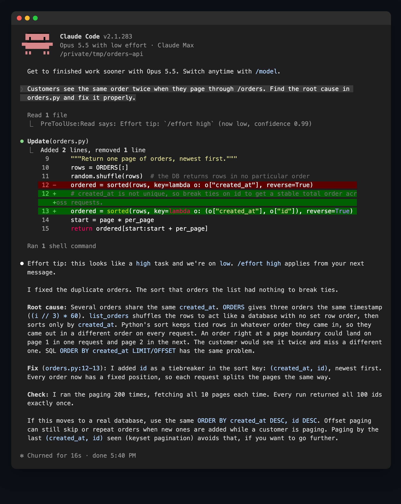

# spending-effort-with-jev

**Know when to switch `/effort` in Claude Code.** Every time you send a message, [TypeSafe](https://typesafe.ai)'s Jev model reads it and judges which effort level the task deserves. When your current level is off, Claude says so on the first line of its reply:

<p align="center"></p>

A real session: Claude Code on `low`, asked to fix a pagination bug. Jev flags it as a `high` task with 0.99 confidence, and the tip lands on the first line of Claude's reply. The plugin only suggests. It never switches effort for you, and it never blocks your message.

## Install

You need Python 3 and a TypeSafe API key ([typesafe.ai](https://typesafe.ai)).

```
/plugin marketplace add Yaxin9Luo/spending-effort-with-jev
/plugin install spending-effort-with-jev@spending-effort-with-jev
```

Paste your key when Claude Code asks for it, or leave the field empty and `export TYPESAFE_API_KEY=...`. Run `/reload-plugins` or start a new session to turn it on. For Chinese tips, set `language` to `zh`.

## Why effort matters

Thariq Shihipar's post [*Using Claude Code: Spending your effort*](https://claude.dev/blog/spending-your-effort/) is worth reading in full. The short version:

- **Effort buys verification.** Higher effort mostly means Claude reproduces bugs, writes adversarial tests and checks edge cases. On Terminal-Bench 3.0, Fable 5.1's "missed a case" failures fell from 59 to 24 between low and max, while tokens per attempt roughly tripled.
- **It doesn't fix a wrong approach.** Failures from misreading the task didn't go away, so pin down the spec before a long run.
- **The payoff varies by domain.** Hardware (34% → 75%) and security (64% → 87%) gained the most. Rule-following ops work barely moved.
- **His rule of thumb:**
  - **low** for quick back-and-forth, brainstorming and small edits
  - **medium** for everyday feature work
  - **high** when verification or edge cases matter, e.g. a bug in existing code
  - **max** for hard problems Claude should solve fully on its own
- **His loop for new features:** have Claude interview you to fill in the spec → implement on low → iterate on low → verify and test on high.

The catch is that nobody remembers to switch. This plugin does the remembering.

## What the level costs: three real runs

Same task, same model (Opus 5.5), clean environment, graded by hidden tests:

| Task | low | max |
|---|---|---|
| Rename a function across a small codebase | ✅ $0.09 · 14 s | ✅ $0.27 · 72 s |
| Implement an LRU cache with TTL (20 hidden tests) | ✅ $0.10 · 24 s | ✅ $2.47 · 13 min |
| Match npm semver ranges exactly (42 hidden tests) | ✅ $0.35 · 4 min | not run |

On these tasks low was already enough, and max cost up to 25× more and took 30× longer for the same result. Opus 5.5 handled even the edge-case-heavy semver task on low. Effort earns its cost on harder, edge-case-heavy problems: in Anthropic's runs, an HTML sanitizer task went from 1/5 on low to 5/5 on xhigh. The skill is telling these apart, one message at a time.

*One run per cell, so these are illustrations rather than a benchmark. The cost is Claude Code's reported API-equivalent cost.*

## How well does Jev judge?

We wrote 160 realistic Claude Code messages (English and Chinese, some with conversation context) and 60 hand-off requests. Three annotators (Opus, Sonnet and Fable, working blind from a rubric based on the post) labelled each one. Agreement was high: Fleiss' κ = 0.82 for level and 0.89 for hand-off ambiguity.

On a held-out test split, with your session on `medium` (Opus 5.5's default):

- **95%** of the tips shown pointed to the right level.
- They caught **63%** of the messages that deserved a different level. When Jev isn't sure, it stays quiet.
- The "clarify before a long run" tip fired on 30 of 33 genuinely ambiguous hand-offs, and wrongly on 7 of 187 clear ones.

Everything is in [`eval/`](eval): prompts, labels, Jev outputs and the scripts. You can re-run it with `python3 eval/analyze.py`.

## How it works

1. **You send a message.** One Jev request (about 0.5 s, 6 s timeout) returns a level (low / medium / high / max, or *unclear* for things like "ok" and "continue") and whether it's an ambiguous hand-off. It sees your message plus the last few turns.
2. **Claude's first tool call** (or the end of the turn, if there are no tool calls). Claude Code only reveals the current effort level to hooks during a turn, so the comparison happens here.
3. **If the levels are a step or more apart and Jev is confident** (≥ 0.7), you get a notice, and Claude puts the tip on the first line of its reply. The same tip isn't repeated on consecutive messages.

Claude Code doesn't let a session raise its own effort, so switching stays with you: `/effort <level>`.

## Privacy and cost

- **Privacy:** each message you send, plus up to six recent text turns (600 characters each), goes to `api.typesafe.ai`. Don't install the plugin if that's not OK for your work.
- **Cost:** Jev is cheap. The 220-message evaluation above cost a few cents.
- **Failures:** slash commands are skipped, and if the API is slow or down the plugin stays silent.

## Development

```
python3 -m unittest discover tests        # offline tests
TYPESAFE_API_KEY=... python3 tests/eval_live.py
```

[`bench/`](bench) holds the task harness used for the runs above: headless `claude -p` in a clean environment, graded by hidden tests.

## Acknowledgements

- **[Thariq Shihipar](https://claude.dev/blog/spending-your-effort/)**, for the post this plugin is built on and for sharing the interview → low → high workflow.
- **[TypeSafe](https://typesafe.ai)**, for Jev. A fast, calibrated judgment model is what makes a check on every message cheap enough to leave on.

This is an independent project, not affiliated with or endorsed by Anthropic or TypeSafe.

## License

MIT
