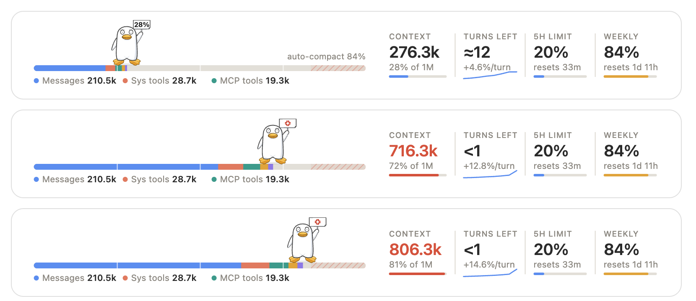
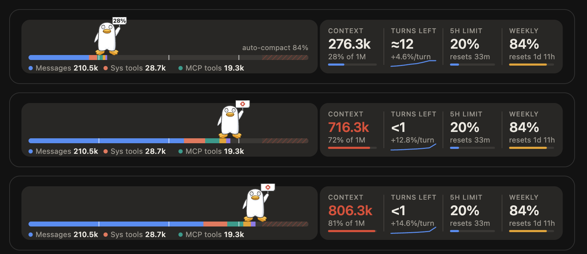

# elizabeth-progress

**Elizabeth walks your context window.** A Claude Code mod: above the prompt, Elizabeth (from *Gintama*) stands on a progress bar of the context window, holding up a sign with how full it is, and walks right as the conversation grows.



- **The bar** is coloured by what fills the window (messages, system tools, MCP tools, skills, system prompt), with the auto-compact zone hatched at its end.
- **Her mood** follows the way to auto-compact: calm, then angry from 80% of the way there (the sign flashes 💢), then in tears from 95%.
- **The figures on the right:** context used, turns left before auto-compact (from the average rise of the last five turns, with a sparkline), the 5-hour and weekly limits with their reset times, and the session's cost. In a window narrower than 900px the cost column and the last two legend entries drop out.
- **In the terminal** it is one line: a bar and `tokens / window (percent)`.

It shares the band: whatever other plugins draw above the prompt stays, and Elizabeth goes underneath. Dark mode is supported.



*Both pictures are drawn from made-up figures.*

## Install

Needs Claude Code 2.1.287 or later. No key and no options.

```
/plugin marketplace add Yaxin9Luo/spending-effort-with-jev
/plugin install elizabeth-progress@spending-effort-with-jev
```

Then `/reload-plugins`. The bar appears after Claude's first reply, when Claude Code first measures the context. The breakdown, the auto-compact zone and turns left fill in as turns end.

It is independent of the effort advisor in the same marketplace: install either or both.

## Where the figures come from

All from Claude Code itself; nothing leaves your machine.

- Context, rate limits and cost: the `session.measure` event, which Claude Code raises whenever it measures new figures (after each API reply). Nothing is polled.
- The breakdown and the auto-compact threshold: `$.session.usage({ breakdown: 'summary' })` at the end of each main-loop turn, a local estimate that makes no request.
- Turns left: the context fill at the end of each main-loop turn, the last 40 kept in memory for the session. Subagents' turns are not counted.

## Development

```
claude plugin test plugins/elizabeth-progress
claude plugin validate plugins/elizabeth-progress
```

`hooks/elizabeth.ts` draws the character (a pure function returning an SVG group), `hooks/band.ts` lays out the band, and `hooks/register.tsx` gathers the figures and draws the band on each surface.

## About the character

Elizabeth is a character from *Gintama* by Hideaki Sorachi (Shueisha). The drawing here is hand-made, unofficial fan art; this plugin is not affiliated with or endorsed by the rights holders, and its MIT license covers the code and drawing only, granting no rights in the character. If you hold those rights and want it taken down, [open an issue](https://github.com/Yaxin9Luo/spending-effort-with-jev/issues).

## License

MIT, for the code and drawing; see [LICENSE](LICENSE).
